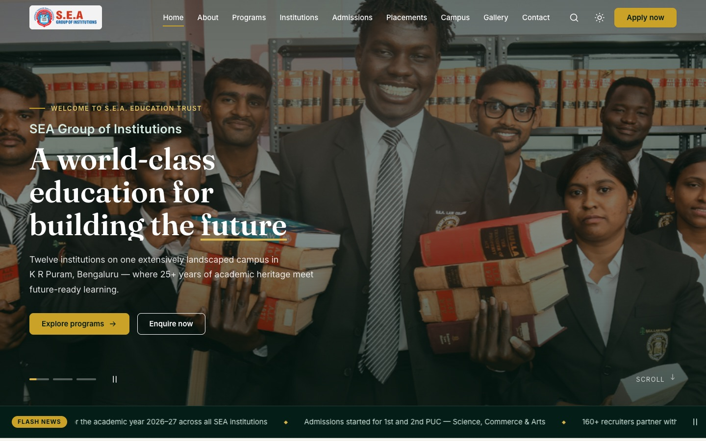
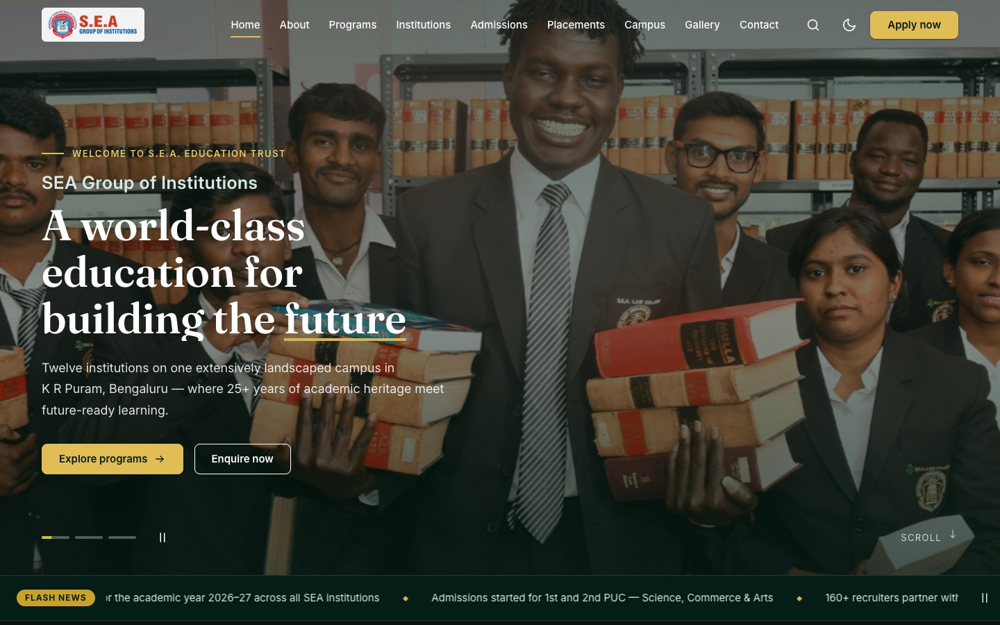
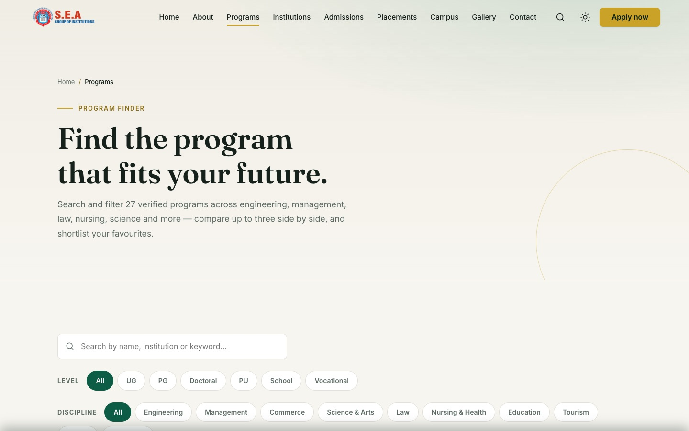

# SEA Group of Institutions — Frontend Redesign

> A complete, original redesign of [seaedu.ac.in](https://seaedu.ac.in/) built for the
> **Frontend Web Development Competition 2026** — pure **HTML5 + CSS3 + vanilla JavaScript**.
> No frameworks, no libraries, no CDN scripts. Every icon, animation and interactive
> system is hand-written.

### 🌐 Live: **[sea-institutions-redesign.vercel.app](https://sea-institutions-redesign.vercel.app)**

## ⏱️ The 2-minute tour

1. **Press <kbd>Ctrl</kbd>+<kbd>K</kbd>** anywhere → type `hostel` → Enter. A hand-built fuzzy-search command palette over every page, section and program.
2. **Toggle the theme** (sun/moon, top right) — the choice persists across pages and visits, with no flash-of-wrong-theme on reload.
3. Open **[Programs](https://sea-institutions-redesign.vercel.app/programs)** → search, filter by level, tick **Compare** on three programs → *Compare now* for a side-by-side table.
4. **Heart a program, then refresh the page** — your shortlist survives (localStorage, no backend).
5. Open **[Apply](https://sea-institutions-redesign.vercel.app/apply)** → type a name, refresh — a banner offers to **restore your draft**. Finish the flow for the honest no-fake-submission success state.
6. On **[Admissions](https://sea-institutions-redesign.vercel.app/admissions)**, scroll slowly — the gold timeline **draws itself**. In the [Gallery](https://sea-institutions-redesign.vercel.app/gallery), filter by campus and open the keyboard-driven lightbox (←/→/Esc).
7. Resize to 375px — no horizontal scroll anywhere; the drawer, filters and forms all adapt.



| Light · Dark · Mobile | |
|---|---|
|  |  |

---

## Design — “Emerald Heritage”

The live site is generic navy + orange Bootstrap. This redesign goes the opposite
direction: **deep emerald green + heritage gold on warm ivory**, inspired by the
campus's famous landscaped gardens and classic university heraldry. Serif display
type (Fraunces) over a clean sans (Inter), a strict 8px spacing scale, hairline
borders, dark emerald “bands” with oversized gold numerals — an old-money
university, rebuilt for 2026.

- **Design tokens** in [`css/tokens.css`](css/tokens.css) — full light **and** dark palettes, fluid type scale (40 → 64px display, rem-anchored `clamp()`), spacing, radii, shadows, motion curves
- **Self-hosted variable fonts** (Fraunces + Inter woff2, ~220KB total) — zero external requests
- Every text/background pair meets **WCAG AA (≥4.5:1)**

## Pages (11)

`index` · `about` · `programs` (finder) · `institutions` · `admissions` · `apply` ·
`placements` · `campus` · `gallery` · `contact` · custom `404`

The original site's 43 pages are consolidated into 10 content-rich pages covering
every navigation section — leadership as tabs, admission categories as accordions,
program details expanding in place.

## JavaScript systems (15 ES modules, ~1,800 lines)

| Module | Powers | Bonus feature |
|---|---|---|
| `theme.js` | Dark/light engine — light-first, persisted choice, no flash of wrong theme | ✅ Dark mode · theme switcher · localStorage |
| `loader.js` | Session-gated loading screen, dismisses when ready (~600ms) | ✅ Loading screen |
| `nav.js` | Glass navbar, scroll progress bar, mobile drawer, scrollspy, back-to-top | ✅ Interactive components |
| `slider.js` | Reusable slider class — cinematic Ken Burns hero + testimonials (autoplay, swipe, keyboard, pause) | ✅ Image slider |
| `reveal.js` | IntersectionObserver scroll choreography + scroll-drawn SVG admissions timeline | ✅ Scroll effects |
| `counters.js` | Odometer stat counters (ease-out cubic) | ✅ Animations |
| `search.js` | **Ctrl+K command palette** — fuzzy search over pages, sections, institutions and programs; recents in localStorage | ✅ Search |
| `forms.js` | Validation engine, 3-step application with **draft autosave**, honest success states | ✅ Form validation · localStorage |
| `gallery.js` | Filter chips, custom lightbox (keyboard ←/→/Esc, focus-trapped), click-to-load videos | ✅ Interactive components |
| `programs.js` | Program finder: live search, level/discipline filters, **compare up to 3**, shortlist with badge | ✅ Search · localStorage |
| `tabs.js` | ARIA-correct tabs + accordions (one system) | ✅ Interactive components |
| `ticker.js` | Flash-news marquee with accessible pause | ✅ Animations |
| `tilt.js` | 3D pointer-tracked card tilt with gold sheen (fine pointers only) | ✅ Effects |
| `utils.js` / `main.js` | Shared helpers, safe storage, focus traps · single entry point | — |

**All 10 bonus features** from the brief are implemented and demonstrable.

## Accessibility & performance

- Semantic landmarks, one `h1` per page, skip-to-content, visible gold focus rings
- Full keyboard paths: menu, tabs, accordions, sliders, lightbox, palette, compare modal, multi-step form
- `aria-live` form errors, correct `autocomplete`, ≥44px touch targets
- **`prefers-reduced-motion`** disables the loader, ticker, tilt, Ken Burns and reveals
- All images sized (`width`/`height`, no CLS), lazy-loaded below the fold, compressed
- Fonts and first hero image preloaded; only `transform`/`opacity` animated; scroll work rAF-batched
- Verified in-browser at 1440 / 768 / 375px: **zero console errors, zero horizontal overflow**, both themes on all 11 pages

## Content integrity

The scraped source contained real errors that were deliberately **not** carried over:
another college's copy-pasted financial-aid page, corrupted stat counters,
contradictory figures and 2021-era notices. This build uses only defensible numbers
(25+ years · 12 institutions · 160+ recruiters · 2000+ alumni), attributes placement
figures to SEA (“as published by SEA Group of Institutions”), and keeps real student
testimonials authentic. The application and contact forms state honestly that this
demonstration does not transmit data and route users to the real admissions office.

## Folder structure

```
├── index.html … contact.html, 404.html   ← 11 pages
├── css/
│   ├── tokens.css        design tokens (both themes)
│   ├── base.css          reset, typography, layout primitives
│   ├── components.css    buttons, nav, cards, forms, overlays…
│   ├── animations.css    keyframes, reveal states, reduced-motion guards
│   └── pages.css         page-specific sections
├── js/
│   ├── main.js           entry point
│   ├── …13 feature modules (ES modules, JSDoc headers)
│   └── data/             programs-data.js · search-index.js
├── assets/               fonts/ img/ logo/ banners/
├── vercel.json           cleanUrls · custom 404 · immutable asset caching
└── scripts/              dev-only asset fetcher (not loaded by any page)
```

## Run it

No build step — it's a static site.

```bash
python3 -m http.server 4173     # or any static server
# open http://127.0.0.1:4173/
```

Deploy: import the repo into Vercel as a static project — `vercel.json` handles
clean URLs, the custom 404 and asset caching.

---

Built with HTML, CSS and vanilla JavaScript only.
Original design; photography and logos © SEA Group of Institutions, used as
source material for this redesign of their own website.
